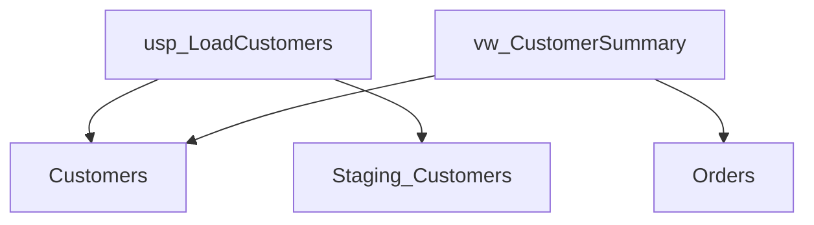

# Data Lineage Patterns Reference

Patterns for building, visualizing, and analyzing data lineage in SQL Server environments.

---

## Lineage Model Concepts

### Node Types

| Type | SQL Server Object | Symbol |
|------|-------------------|--------|
| Source | Base Table | ⬜ Rectangle |
| Transformation | Stored Procedure, Function | ⬡ Hexagon |
| View | View | ◇ Diamond |
| Target | Reporting Table, Data Mart | ⬜ Rectangle (filled) |

### Edge Types

| Type | Description | Example |
|------|-------------|---------|
| Read | Object reads from source | Proc → Table (SELECT) |
| Write | Object writes to target | Proc → Table (INSERT/UPDATE) |
| Derive | Object creates derived data | View → Base Table |

---

## Lineage Graph Data Structures

### C# Models

```csharp
public class LineageGraph
{
    public List<LineageNode> Nodes { get; set; } = [];
    public List<LineageEdge> Edges { get; set; } = [];
    public Dictionary<string, object> Metadata { get; set; } = [];
}

public class LineageNode
{
    public string Id { get; set; }          // schema.object_name
    public string Name { get; set; }
    public string Schema { get; set; }
    public NodeType Type { get; set; }
    public int? RowCount { get; set; }
    public DateTime? LastModified { get; set; }
    public Dictionary<string, string> Properties { get; set; } = [];
}

public class LineageEdge
{
    public string SourceId { get; set; }
    public string TargetId { get; set; }
    public EdgeType Type { get; set; }      // Read, Write, Derive
    public string TransformationLogic { get; set; }
}

public enum NodeType { Table, View, Procedure, Function, ExternalSource }
public enum EdgeType { Read, Write, Derive, Reference }
```

### JSON Schema

```json
{
  "nodes": [
    {
      "id": "dbo.Customers",
      "name": "Customers",
      "schema": "dbo",
      "type": "Table",
      "rowCount": 50000,
      "properties": {
        "classification": "PII",
        "owner": "DataTeam"
      }
    }
  ],
  "edges": [
    {
      "source": "dbo.Customers",
      "target": "dbo.CustomerSummary",
      "type": "Derive",
      "transformedBy": "dbo.usp_RefreshCustomerSummary"
    }
  ]
}
```

---

## SQL Queries for Lineage Extraction

### Build Complete Lineage Graph

```sql
-- Extract all nodes and edges for a schema
WITH Nodes AS (
    SELECT 
        s.name + '.' + o.name AS id,
        o.name AS name,
        s.name AS schema_name,
        o.type_desc AS node_type,
        o.object_id
    FROM sys.objects o
    JOIN sys.schemas s ON o.schema_id = s.schema_id
    WHERE o.type IN ('U', 'V', 'P', 'FN', 'IF', 'TF')
      AND s.name = @SchemaName
),
Edges AS (
    SELECT 
        n.id AS source_id,
        COALESCE(d.referenced_schema_name, 'dbo') + '.' + d.referenced_entity_name AS target_id,
        'Reference' AS edge_type
    FROM sys.sql_expression_dependencies d
    JOIN Nodes n ON d.referencing_id = n.object_id
    WHERE d.referenced_entity_name IS NOT NULL
)
SELECT 
    'node' AS record_type, id, name, schema_name, node_type, NULL AS source_id, NULL AS target_id
FROM Nodes
UNION ALL
SELECT 
    'edge', NULL, NULL, NULL, NULL, source_id, target_id
FROM Edges;
```

### Upstream Lineage (What Feeds This?)

```sql
-- Trace upstream lineage for a target object
WITH UpstreamLineage AS (
    -- Anchor: Direct dependencies
    SELECT 
        COALESCE(d.referenced_schema_name, 'dbo') + '.' + d.referenced_entity_name AS source_object,
        OBJECT_SCHEMA_NAME(d.referencing_id) + '.' + OBJECT_NAME(d.referencing_id) AS target_object,
        1 AS depth
    FROM sys.sql_expression_dependencies d
    WHERE OBJECT_NAME(d.referencing_id) = @TargetObject
      AND d.referenced_entity_name IS NOT NULL
    
    UNION ALL
    
    -- Recursive: Walk upstream
    SELECT 
        COALESCE(d.referenced_schema_name, 'dbo') + '.' + d.referenced_entity_name,
        ul.source_object,
        ul.depth + 1
    FROM sys.sql_expression_dependencies d
    JOIN UpstreamLineage ul ON OBJECT_SCHEMA_NAME(d.referencing_id) + '.' + OBJECT_NAME(d.referencing_id) = ul.source_object
    WHERE ul.depth < 10
      AND d.referenced_entity_name IS NOT NULL
)
SELECT DISTINCT source_object, target_object, depth
FROM UpstreamLineage
ORDER BY depth, source_object;
```

### Downstream Lineage (What Does This Feed?)

```sql
-- Trace downstream lineage from a source object
WITH DownstreamLineage AS (
    -- Anchor: Direct dependents
    SELECT 
        @SourceObject AS source_object,
        OBJECT_SCHEMA_NAME(d.referencing_id) + '.' + OBJECT_NAME(d.referencing_id) AS target_object,
        1 AS depth
    FROM sys.sql_expression_dependencies d
    WHERE d.referenced_entity_name = @SourceObject
    
    UNION ALL
    
    -- Recursive: Walk downstream
    SELECT 
        dl.target_object,
        OBJECT_SCHEMA_NAME(d.referencing_id) + '.' + OBJECT_NAME(d.referencing_id),
        dl.depth + 1
    FROM sys.sql_expression_dependencies d
    JOIN DownstreamLineage dl ON d.referenced_entity_name = PARSENAME(dl.target_object, 1)
    WHERE dl.depth < 10
)
SELECT DISTINCT source_object, target_object, depth
FROM DownstreamLineage
ORDER BY depth, target_object;
```

---

## Visualization Patterns

### Mermaid Flowchart Generation

```sql
-- Generate Mermaid diagram syntax
DECLARE @mermaid NVARCHAR(MAX) = 'graph TD' + CHAR(13);

SELECT @mermaid = @mermaid + 
    '    ' + 
    REPLACE(REPLACE(OBJECT_NAME(d.referencing_id), ' ', '_'), '-', '_') + 
    '[' + OBJECT_NAME(d.referencing_id) + ']' +
    ' --> ' + 
    REPLACE(REPLACE(d.referenced_entity_name, ' ', '_'), '-', '_') + 
    '[' + d.referenced_entity_name + ']' + CHAR(13)
FROM sys.sql_expression_dependencies d
JOIN sys.objects o ON d.referencing_id = o.object_id
WHERE OBJECT_SCHEMA_NAME(d.referencing_id) = @SchemaName
  AND d.referenced_entity_name IS NOT NULL;

SELECT @mermaid AS mermaid_diagram;
```

**Output Example:**


### D3.js/React Flow JSON

```sql
-- Generate JSON for D3.js force-directed graph
SELECT 
    (
        SELECT DISTINCT
            OBJECT_SCHEMA_NAME(o.object_id) + '.' + o.name AS id,
            o.name AS label,
            CASE o.type 
                WHEN 'U' THEN 'table'
                WHEN 'V' THEN 'view'
                WHEN 'P' THEN 'procedure'
                ELSE 'other'
            END AS [type]
        FROM sys.objects o
        WHERE OBJECT_SCHEMA_NAME(o.object_id) = @SchemaName
        FOR JSON PATH
    ) AS nodes,
    (
        SELECT 
            OBJECT_SCHEMA_NAME(d.referencing_id) + '.' + OBJECT_NAME(d.referencing_id) AS source,
            COALESCE(d.referenced_schema_name, 'dbo') + '.' + d.referenced_entity_name AS target
        FROM sys.sql_expression_dependencies d
        WHERE OBJECT_SCHEMA_NAME(d.referencing_id) = @SchemaName
          AND d.referenced_entity_name IS NOT NULL
        FOR JSON PATH
    ) AS links
FOR JSON PATH, WITHOUT_ARRAY_WRAPPER;
```

### DOT (Graphviz) Format

```sql
-- Generate DOT syntax for Graphviz
DECLARE @dot NVARCHAR(MAX) = 'digraph Lineage {' + CHAR(13) +
    '    rankdir=LR;' + CHAR(13) +
    '    node [shape=box];' + CHAR(13);

-- Add node styles by type
SELECT @dot = @dot + 
    '    "' + OBJECT_NAME(o.object_id) + '" [shape=' +
    CASE o.type 
        WHEN 'U' THEN 'box'
        WHEN 'V' THEN 'diamond'
        WHEN 'P' THEN 'hexagon'
        ELSE 'ellipse'
    END + '];' + CHAR(13)
FROM sys.objects o
WHERE OBJECT_SCHEMA_NAME(o.object_id) = @SchemaName;

-- Add edges
SELECT @dot = @dot + 
    '    "' + OBJECT_NAME(d.referencing_id) + '" -> "' + d.referenced_entity_name + '";' + CHAR(13)
FROM sys.sql_expression_dependencies d
WHERE OBJECT_SCHEMA_NAME(d.referencing_id) = @SchemaName
  AND d.referenced_entity_name IS NOT NULL;

SET @dot = @dot + '}';
SELECT @dot AS dot_diagram;
```

---

## Lineage Types

### Table-Level Lineage

Shows which tables feed into other tables through transformations.

```sql
-- Table-to-table lineage through procedures
SELECT DISTINCT
    src.referenced_entity_name AS source_table,
    tgt.referenced_entity_name AS target_table,
    OBJECT_NAME(src.referencing_id) AS transformation_proc
FROM sys.sql_expression_dependencies src
JOIN sys.sql_expression_dependencies tgt 
    ON src.referencing_id = tgt.referencing_id
JOIN sys.objects o ON src.referencing_id = o.object_id
WHERE o.type = 'P'  -- Procedures only
  AND src.referenced_entity_name <> tgt.referenced_entity_name
  AND src.referenced_entity_name IS NOT NULL
  AND tgt.referenced_entity_name IS NOT NULL;
```

### Column-Level Lineage

More granular - tracks individual column transformations.

```sql
-- Column-level dependencies (where available)
SELECT 
    OBJECT_SCHEMA_NAME(d.referencing_id) AS referencing_schema,
    OBJECT_NAME(d.referencing_id) AS referencing_object,
    COL_NAME(d.referencing_id, d.referencing_minor_id) AS referencing_column,
    d.referenced_schema_name,
    d.referenced_entity_name,
    COL_NAME(d.referenced_id, d.referenced_minor_id) AS referenced_column
FROM sys.sql_expression_dependencies d
WHERE d.referencing_minor_id > 0  -- Column-level reference
   OR d.referenced_minor_id > 0
ORDER BY referencing_object, referencing_column;
```

### Cross-Database Lineage

```sql
-- Find cross-database dependencies
SELECT 
    OBJECT_SCHEMA_NAME(d.referencing_id) AS local_schema,
    OBJECT_NAME(d.referencing_id) AS local_object,
    d.referenced_database_name AS remote_database,
    d.referenced_schema_name AS remote_schema,
    d.referenced_entity_name AS remote_object
FROM sys.sql_expression_dependencies d
WHERE d.referenced_database_name IS NOT NULL
ORDER BY d.referenced_database_name, d.referenced_entity_name;
```

---

## ETL Lineage Patterns

### Source → Staging → Transform → Target

```sql
-- Common ETL pattern detection
WITH ETLPattern AS (
    SELECT 
        d.referenced_entity_name AS source_table,
        OBJECT_NAME(d.referencing_id) AS process_name,
        CASE 
            WHEN d.referenced_entity_name LIKE '%staging%' THEN 'Staging'
            WHEN d.referenced_entity_name LIKE '%stg%' THEN 'Staging'
            WHEN d.referenced_entity_name LIKE '%raw%' THEN 'Raw'
            WHEN d.referenced_entity_name LIKE '%dim%' THEN 'Dimension'
            WHEN d.referenced_entity_name LIKE '%fact%' THEN 'Fact'
            WHEN d.referenced_entity_name LIKE '%kpi%' THEN 'KPI'
            WHEN d.referenced_entity_name LIKE '%sum%' THEN 'Summary'
            ELSE 'Unknown'
        END AS table_layer
    FROM sys.sql_expression_dependencies d
    JOIN sys.objects o ON d.referencing_id = o.object_id
    WHERE o.type = 'P'
      AND d.referenced_entity_name IS NOT NULL
)
SELECT 
    table_layer,
    COUNT(DISTINCT source_table) AS table_count,
    STRING_AGG(DISTINCT source_table, ', ') 
        WITHIN GROUP (ORDER BY source_table) AS tables
FROM ETLPattern
GROUP BY table_layer
ORDER BY 
    CASE table_layer 
        WHEN 'Raw' THEN 1 
        WHEN 'Staging' THEN 2 
        WHEN 'Dimension' THEN 3 
        WHEN 'Fact' THEN 4 
        WHEN 'Summary' THEN 5
        WHEN 'KPI' THEN 6
        ELSE 99 
    END;
```

---

## .NET Lineage Service Implementation

```csharp
public class LineageService : ILineageService
{
    private readonly IDbConnection _connection;
    
    public async Task<LineageGraph> BuildLineageGraphAsync(string schemaName)
    {
        var graph = new LineageGraph();
        
        // Get nodes
        var nodesSql = @"
            SELECT 
                s.name + '.' + o.name AS Id,
                o.name AS Name,
                s.name AS [Schema],
                o.type_desc AS NodeType
            FROM sys.objects o
            JOIN sys.schemas s ON o.schema_id = s.schema_id
            WHERE s.name = @SchemaName
              AND o.type IN ('U', 'V', 'P', 'FN')";
        
        graph.Nodes = (await _connection.QueryAsync<LineageNode>(
            nodesSql, new { SchemaName = schemaName })).ToList();
        
        // Get edges
        var edgesSql = @"
            SELECT 
                OBJECT_SCHEMA_NAME(d.referencing_id) + '.' + OBJECT_NAME(d.referencing_id) AS SourceId,
                COALESCE(d.referenced_schema_name, 'dbo') + '.' + d.referenced_entity_name AS TargetId,
                'Reference' AS EdgeType
            FROM sys.sql_expression_dependencies d
            WHERE OBJECT_SCHEMA_NAME(d.referencing_id) = @SchemaName
              AND d.referenced_entity_name IS NOT NULL";
        
        graph.Edges = (await _connection.QueryAsync<LineageEdge>(
            edgesSql, new { SchemaName = schemaName })).ToList();
        
        return graph;
    }
    
    public async Task<List<string>> GetUpstreamAsync(string objectName, int maxDepth = 5)
    {
        var sql = @"
            WITH Upstream AS (
                SELECT d.referenced_entity_name AS name, 1 AS depth
                FROM sys.sql_expression_dependencies d
                WHERE OBJECT_NAME(d.referencing_id) = @ObjectName
                  AND d.referenced_entity_name IS NOT NULL
                UNION ALL
                SELECT d.referenced_entity_name, u.depth + 1
                FROM sys.sql_expression_dependencies d
                JOIN Upstream u ON OBJECT_NAME(d.referencing_id) = u.name
                WHERE u.depth < @MaxDepth
                  AND d.referenced_entity_name IS NOT NULL
            )
            SELECT DISTINCT name FROM Upstream ORDER BY name";
        
        return (await _connection.QueryAsync<string>(
            sql, new { ObjectName = objectName, MaxDepth = maxDepth })).ToList();
    }
}
```

---

## Best Practices

### 1. Cache Lineage Graphs
Lineage queries are expensive. Cache results and refresh periodically:

```csharp
public class CachedLineageService
{
    private readonly IMemoryCache _cache;
    private readonly ILineageService _inner;
    
    public async Task<LineageGraph> GetLineageAsync(string schema)
    {
        var key = $"lineage:{schema}";
        
        if (!_cache.TryGetValue(key, out LineageGraph graph))
        {
            graph = await _inner.BuildLineageGraphAsync(schema);
            _cache.Set(key, graph, TimeSpan.FromHours(1));
        }
        
        return graph;
    }
}
```

### 2. Handle Unresolved References
When `referenced_id` is NULL, the object couldn't be resolved:

```sql
-- Find unresolved dependencies (potential issues)
SELECT 
    OBJECT_NAME(d.referencing_id) AS referencing_object,
    d.referenced_entity_name AS unresolved_reference,
    d.is_ambiguous
FROM sys.sql_expression_dependencies d
WHERE d.referenced_id IS NULL
  AND d.referenced_entity_name IS NOT NULL;
```

### 3. Account for Dynamic SQL
Dynamic SQL dependencies aren't captured. Document them separately:

```sql
-- Search for dynamic SQL in procedure definitions
SELECT 
    OBJECT_SCHEMA_NAME(object_id) AS schema_name,
    OBJECT_NAME(object_id) AS proc_name
FROM sys.sql_modules
WHERE definition LIKE '%EXEC(%'
   OR definition LIKE '%EXECUTE(%'
   OR definition LIKE '%sp_executesql%';
```
