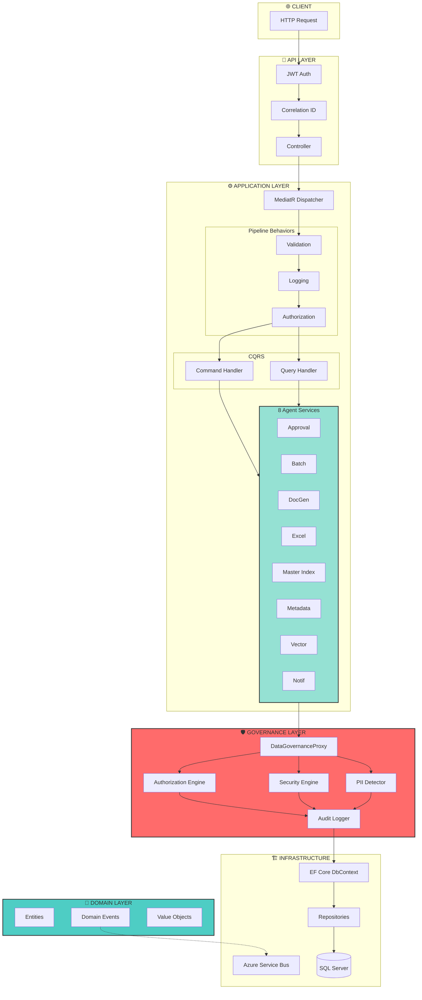

# Enterprise Documentation Platform - Architecture Visualization

> A multi-perspective view of the system architecture using Clean Architecture, DDD, and CQRS patterns.

---

## 1. THE ORBITAL VIEW - Clean Architecture Layers

This radial diagram shows the **dependency rule**: outer layers depend on inner layers, never the reverse.

```
                                    ╭─────────────────────────────────────────────────────────────╮
                                    │                         API LAYER                           │
                                    │    ┌─────────┐  ┌──────────┐  ┌──────────┐  ┌─────────┐    │
                                    │    │  Auth   │  │Documents │  │  Batch   │  │Templates│    │
                                    │    │Controller│ │Controller│  │Controller│  │Controller│   │
                                    │    └────┬────┘  └────┬─────┘  └────┬─────┘  └────┬────┘    │
                                    ╰─────────┼───────────┼──────────────┼────────────┼──────────╯
                                              │           │              │            │
                          ╭───────────────────┴───────────┴──────────────┴────────────┴───────────────────╮
                          │                              INFRASTRUCTURE LAYER                              │
                          │  ┌──────────────────┐   ┌───────────────────┐   ┌──────────────────────────┐  │
                          │  │   PERSISTENCE    │   │     MESSAGING     │   │      REPOSITORIES        │  │
                          │  │  ┌────────────┐  │   │  ┌─────────────┐  │   │  ┌────────┐ ┌────────┐  │  │
                          │  │  │  EF Core   │  │   │  │Azure Service│  │   │  │Document│ │  User  │  │  │
                          │  │  │  DbContext │  │   │  │    Bus      │  │   │  │  Repo  │ │  Repo  │  │  │
                          │  │  └────────────┘  │   │  └─────────────┘  │   │  └────────┘ └────────┘  │  │
                          │  └──────────────────┘   └───────────────────┘   └──────────────────────────┘  │
                          ╰───────────────────────────────────┬───────────────────────────────────────────╯
                                                              │
                    ╭─────────────────────────────────────────┴─────────────────────────────────────────╮
                    │                                  APPLICATION LAYER                                 │
                    │                                                                                    │
                    │   ┌─────────────────────────────── CQRS ───────────────────────────────┐          │
                    │   │                                                                    │          │
                    │   │    COMMANDS                              QUERIES                   │          │
                    │   │   ┌────────────┐                      ┌────────────┐              │          │
                    │   │   │CreateDoc   │     ──MediatR──►     │GetDocument │              │          │
                    │   │   │UpdateDoc   │                      │SearchDocs  │              │          │
                    │   │   │ApproveDoc  │                      │GetByUser   │              │          │
                    │   │   └────────────┘                      └────────────┘              │          │
                    │   └────────────────────────────────────────────────────────────────────┘          │
                    │                                                                                    │
                    │   ┌─────────────────────────── 8 AGENT SERVICES ──────────────────────┐           │
                    │   │  ┌──────────┐ ┌──────────┐ ┌──────────┐ ┌──────────┐             │           │
                    │   │  │ Approval │ │  Batch   │ │  DocGen  │ │  Excel   │             │           │
                    │   │  │ Tracking │ │Processing│ │ AutoDraft│ │  Sync    │             │           │
                    │   │  └──────────┘ └──────────┘ └──────────┘ └──────────┘             │           │
                    │   │  ┌──────────┐ ┌──────────┐ ┌──────────┐ ┌──────────┐             │           │
                    │   │  │  Master  │ │ Metadata │ │  Vector  │ │  Notif   │             │           │
                    │   │  │  Index   │ │Extraction│ │ Indexing │ │ (Teams)  │             │           │
                    │   │  └──────────┘ └──────────┘ └──────────┘ └──────────┘             │           │
                    │   └──────────────────────────────────────────────────────────────────┘           │
                    ╰───────────────────────────────────────┬───────────────────────────────────────────╯
                                                            │
                          ╭─────────────────────────────────┴─────────────────────────────────╮
                          │                           DOMAIN LAYER                             │
                          │                        (Pure Business Logic)                       │
                          │                                                                    │
                          │    ┌────────────────── AGGREGATES ──────────────────┐             │
                          │    │                                                 │             │
                          │    │   ┌──────────┐   ┌──────────┐   ┌──────────┐  │             │
                          │    │   │ Document │   │   User   │   │  Agent   │  │             │
                          │    │   │(Root)    │   │ (Root)   │   │  (Root)  │  │             │
                          │    │   └──────────┘   └──────────┘   └──────────┘  │             │
                          │    │   ┌──────────┐   ┌──────────┐   ┌──────────┐  │             │
                          │    │   │ Template │   │ Version  │   │ AuditLog │  │             │
                          │    │   │ (Root)   │   │  (Root)  │   │  (Root)  │  │             │
                          │    │   └──────────┘   └──────────┘   └──────────┘  │             │
                          │    └─────────────────────────────────────────────────┘             │
                          │                                                                    │
                          │    ┌──────────── VALUE OBJECTS ─────────────┐                     │
                          │    │  DocumentId │ UserId │ ApprovalStatus  │                     │
                          │    │  SecurityClassification │ AgentId      │                     │
                          │    └────────────────────────────────────────┘                     │
                          │                                                                    │
                          │    ┌──────────── DOMAIN EVENTS ─────────────┐                     │
                          │    │  DocumentCreated │ DocumentPublished   │                     │
                          │    │  UserCreated │ TemplateUpdated         │                     │
                          │    └────────────────────────────────────────┘                     │
                          ╰────────────────────────────────────────────────────────────────────╯
```

---

## 2. THE METRO MAP - Agent/Service Interconnections

Each "line" represents a major capability flow. Stations are components. Transfer stations show integration points.

```
    ══════════════════════════════════════════════════════════════════════════════════════════════════

    DOCUMENT LIFECYCLE LINE (Blue) ═══════════════════════════════════════════════════════════════════

         ◉────────────◉────────────◉────────────◉────────────◉────────────◉────────────◉
       Create       Draft       Review      Approve      Publish      Archive      Delete
         │            │            │            │            │
         │            │            │            ╰────────────╋──────────────────────────────────┐
         │            │            │                         │                                  │
    ═════╪════════════╪════════════╪═════════════════════════╪══════════════════════════════════╪═════
    AI GENERATION LINE (Green)                               │                                  │
         │            │            │                         │                                  │
         ◎────────────◎────────────◎────────────◎            │                                  │
      Template    AutoDraft    OpenAI       DocId            │                                  │
      Executor    Service    Enhancement  Generator          │                                  │
                     │                                       │                                  │
    ═════════════════╪═══════════════════════════════════════╪══════════════════════════════════╪═════
    SEARCH & DISCOVERY LINE (Orange)                         │                                  │
                     │                                       │                                  │
         ◎───────────╋───────────◎────────────◎──────────────╋                                  │
      Metadata       │        Vector       Master            │                                  │
     Extraction      │       Indexing       Index            │                                  │
         │           │           │            │              │                                  │
    ═════╪═══════════╪═══════════╪════════════╪══════════════╪══════════════════════════════════╪═════
    DATA GOVERNANCE LINE (Red) ══╋════════════╋══════════════╋══════════════════════════════════╪═════
         │           │           │            │              │                                  │
         ◉───────────◉───────────◉────────────◉──────────────◉──────────────────────────────────◉
       Query       Auth      Security      PII           Audit                              Compliance
      Validator   Engine     Engine      Detector       Logger                               Report
         │                                                   │
    ═════╪═══════════════════════════════════════════════════╪════════════════════════════════════════
    INTEGRATION LINE (Purple)                                │
         │                                                   │
         ◎────────────◎────────────◎────────────◎────────────◎
       Excel       Teams       Azure        Batch        Background
        Sync     Notifier   ServiceBus   Orchestrator     Jobs

    ══════════════════════════════════════════════════════════════════════════════════════════════════

    LEGEND:  ◉ = Core Component    ◎ = Support Service    ═══ = Line    ─── = Track    ╋ = Transfer
```

---

## 3. THE CONSTELLATION - Bounded Contexts

A star map showing how bounded contexts relate, with gravitational pull indicating coupling strength.

```
                                              ┌─────────────────────────────────────┐
                                              │                                     │
                                              │      ★ DOCUMENT MANAGEMENT          │
                                              │        ┌──────────────┐             │
                                              │        │  Document    │             │
                                              │        │  Version     │             │
                                              │        │  Template    │             │
                                              │        └──────┬───────┘             │
                                              │               │                     │
                                              └───────────────┼─────────────────────┘
                                                              │
                        ┌─────────────────────────────────────┼─────────────────────────────────────┐
                        │                                     │                                     │
           ┌────────────┴────────────┐           ┌────────────┴────────────┐           ┌────────────┴────────────┐
           │                         │           │                         │           │                         │
           │  ☆ APPROVAL WORKFLOW    │           │   ★ USER & SECURITY     │           │  ☆ CONTENT GENERATION   │
           │  ┌─────────────────┐    │◄─────────►│  ┌─────────────────┐    │◄─────────►│  ┌─────────────────┐    │
           │  │ ApprovalStatus  │    │           │  │ User            │    │           │  │ AutoDraftService│    │
           │  │ ApprovalTracking│    │           │  │ Roles           │    │           │  │ TemplateExecutor│    │
           │  │ WorkflowEngine  │    │           │  │ SecurityClear   │    │           │  │ OpenAI Enhance  │    │
           │  └─────────────────┘    │           │  └─────────────────┘    │           │  └─────────────────┘    │
           │                         │           │                         │           │                         │
           └────────────┬────────────┘           └────────────┬────────────┘           └────────────┬────────────┘
                        │                                     │                                     │
                        │                                     │                                     │
                        │              ┌──────────────────────┴──────────────────────┐              │
                        │              │                                             │              │
                        │              │       ★★★ GOVERNANCE & COMPLIANCE ★★★       │              │
                        │              │            (Central Authority)              │              │
                        └──────────────┤  ┌─────────────────────────────────────┐   ├──────────────┘
                                       │  │  DataGovernanceProxy (MANDATORY)    │   │
                                       │  │  ┌────────────┐  ┌────────────┐     │   │
                                       │  │  │ AuthEngine │  │ PIIDetector│     │   │
                                       │  │  └────────────┘  └────────────┘     │   │
                                       │  │  ┌────────────┐  ┌────────────┐     │   │
                                       │  │  │SecurityEng │  │AuditLogger │     │   │
                                       │  │  └────────────┘  └────────────┘     │   │
                                       │  └─────────────────────────────────────┘   │
                                       │                                             │
                                       └──────────────────────┬──────────────────────┘
                                                              │
                        ┌─────────────────────────────────────┼─────────────────────────────────────┐
                        │                                     │                                     │
           ┌────────────┴────────────┐           ┌────────────┴────────────┐           ┌────────────┴────────────┐
           │                         │           │                         │           │                         │
           │  ☆ SEARCH & DISCOVERY   │           │   ☆ AGENT MANAGEMENT    │           │  ☆ INTEGRATION          │
           │  ┌─────────────────┐    │           │  ┌─────────────────┐    │           │  ┌─────────────────┐    │
           │  │ MasterIndex     │    │◄─────────►│  │ Agent Entity    │    │◄─────────►│  │ ExcelSyncService│    │
           │  │ VectorIndexing  │    │           │  │ BaseAgent       │    │           │  │ TeamsNotifier   │    │
           │  │ MetadataExtract │    │           │  │ Capabilities    │    │           │  │ BatchOrchestrator│   │
           │  └─────────────────┘    │           │  └─────────────────┘    │           │  │ AzureServiceBus │    │
           │                         │           │                         │           │  └─────────────────┘    │
           └─────────────────────────┘           └─────────────────────────┘           └─────────────────────────┘

    LEGEND:  ★★★ = Core Context (highest gravity)    ★ = Primary Context    ☆ = Supporting Context
             ◄────► = Strong coupling (shared kernel)    ─── = Standard relationship
```

---

## 4. THE TREE OF LIFE - Solution Structure

A botanical view of the solution showing how projects grow from shared roots.

```
                                         🌳 EnterpriseDocumentationPlatform.sln
                                                        │
                    ┌───────────────────────────────────┴───────────────────────────────────┐
                    │                                                                       │
              ══════╧══════                                                           ══════╧══════
              ║   src   ║                                                             ║  tests  ║
              ══════╤══════                                                           ══════╤══════
                    │                                                                       │
        ┌───────────┼───────────┬───────────────────┐                           ┌──────────┴──────────┐
        │           │           │                   │                           │                     │
    ════╧════   ════╧════   ════╧════           ════╧════                   ════╧════             ════╧════
    ║  Api  ║   ║ Core ║   ║Shared║           ║ docs ║                   ║  Unit  ║           ║Integration║
    ════╤════   ════╤════   ════╤════           ════════                   ════╤════             ════╤════
        │           │           │                                               │                     │
        │           │           ├── Contracts/                                  ├── Entities/         │
        │           │           │   ├── DTOs/                                   ├── Services/         ├── Controllers/
        │           │           │   ├── Interfaces/                             └── ValueObjects/     └── Helpers/
        │           │           │   └── Events/
        │           │           │
        │           │           ├── BaseAgent/
        │           │           │   ├── BaseAgent.cs        ◄─── Reusable agent foundation
        │           │           │   └── IAgent.cs
        │           │           │
        │           │           ├── Extensions/
        │           │           └── Configuration/
        │           │
        │           ├── Domain/
        │           │   ├── Entities/
        │           │   │   ├── Document.cs                 ◄─── Aggregate Root
        │           │   │   ├── User.cs                     ◄─── Aggregate Root
        │           │   │   ├── Agent.cs                    ◄─── Aggregate Root
        │           │   │   ├── Template.cs                 ◄─── Aggregate Root
        │           │   │   ├── Version.cs                  ◄─── Aggregate Root
        │           │   │   └── AuditLog.cs                 ◄─── Aggregate Root
        │           │   ├── ValueObjects/
        │           │   │   ├── DocumentId.cs
        │           │   │   ├── ApprovalStatus.cs
        │           │   │   └── SecurityClassification.cs
        │           │   ├── Events/
        │           │   ├── Specifications/
        │           │   └── Services/
        │           │
        │           ├── Application/
        │           │   ├── Commands/
        │           │   │   └── Documents/
        │           │   │       ├── CreateDocumentCommand.cs
        │           │   │       ├── UpdateDocumentCommand.cs
        │           │   │       └── ApproveDocumentCommand.cs
        │           │   ├── Queries/
        │           │   │   └── Documents/
        │           │   │       ├── GetDocumentQuery.cs
        │           │   │       ├── SearchDocumentsQuery.cs
        │           │   │       └── GetDocumentsByUserQuery.cs
        │           │   ├── Services/                       ◄─── 8 AGENT SERVICES
        │           │   │   ├── ApprovalTracking/
        │           │   │   ├── Batch/
        │           │   │   ├── DocumentGeneration/
        │           │   │   │   ├── AutoDraftService.cs
        │           │   │   │   ├── TemplateExecutorService.cs
        │           │   │   │   └── OpenAIEnhancementService.cs
        │           │   │   ├── ExcelSync/
        │           │   │   ├── MasterIndex/
        │           │   │   ├── MetadataExtraction/
        │           │   │   ├── VectorIndexing/
        │           │   │   └── Notifications/
        │           │   ├── Behaviors/                      ◄─── MediatR Pipeline
        │           │   │   ├── ValidationBehavior.cs
        │           │   │   ├── LoggingBehavior.cs
        │           │   │   └── AuthorizationBehavior.cs
        │           │   ├── EventHandlers/
        │           │   └── Mappings/
        │           │
        │           ├── Infrastructure/
        │           │   ├── Persistence/
        │           │   │   ├── DocumentationDbContext.cs   ◄─── EF Core
        │           │   │   ├── Repositories/
        │           │   │   ├── Configurations/
        │           │   │   └── Migrations/
        │           │   ├── Messaging/
        │           │   │   └── AzureServiceBusMessageBus.cs
        │           │   └── Extensions/
        │           │
        │           ├── Governance/                         ◄─── MANDATORY GATEWAY
        │           │   ├── IDataGovernanceProxy.cs
        │           │   ├── DataGovernanceProxy.cs
        │           │   ├── GovernanceAuthorizationEngine.cs
        │           │   ├── GovernanceSecurityEngine.cs
        │           │   ├── GovernancePIIDetector.cs
        │           │   ├── GovernanceAuditLogger.cs
        │           │   └── GovernanceQueryRequestValidator.cs
        │           │
        │           └── Quality/
        │               ├── EnterpriseAIQualitySystem.cs
        │               ├── ComplexityAnalyzer.cs
        │               ├── QualityValidator.cs
        │               └── QualityReporter.cs
        │
        ├── Controllers/
        │   ├── AuthController.cs
        │   ├── DocumentsController.cs
        │   ├── BatchProcessingController.cs
        │   ├── TemplatesController.cs
        │   └── UsersController.cs
        ├── Services/
        │   ├── CurrentUserService.cs
        │   └── SimpleAuthorizationService.cs
        └── Program.cs
```

---

## 5. THE FLOW DIAGRAM - Request/Response Lifecycle



---

## 6. THE DATA FLOW - How Information Travels

```
    ╔═══════════════════════════════════════════════════════════════════════════════════════════════════╗
    ║                                    DATA FLOW ARCHITECTURE                                          ║
    ╠═══════════════════════════════════════════════════════════════════════════════════════════════════╣
    ║                                                                                                    ║
    ║    ┌──────────────┐                                                                               ║
    ║    │   CLIENT     │                                                                               ║
    ║    │  (Browser/   │                                                                               ║
    ║    │   Mobile)    │                                                                               ║
    ║    └──────┬───────┘                                                                               ║
    ║           │                                                                                        ║
    ║           ▼                                                                                        ║
    ║    ╔══════════════╗    HTTP/JSON    ╔══════════════╗                                              ║
    ║    ║    HTTPS     ║ ═══════════════► ║     API      ║                                              ║
    ║    ║   Gateway    ║                  ║   (REST)     ║                                              ║
    ║    ╚══════════════╝                  ╚══════╤═══════╝                                              ║
    ║                                             │                                                      ║
    ║                                             │ MediatR Command/Query                                ║
    ║                                             ▼                                                      ║
    ║                                      ╔══════════════╗                                              ║
    ║                                      ║ APPLICATION  ║                                              ║
    ║                                      ║   LAYER      ║                                              ║
    ║                                      ╚══════╤═══════╝                                              ║
    ║                                             │                                                      ║
    ║           ┌─────────────────────────────────┼─────────────────────────────────┐                   ║
    ║           │                                 │                                 │                   ║
    ║           ▼                                 ▼                                 ▼                   ║
    ║    ┌─────────────┐                   ┌─────────────┐                   ┌─────────────┐           ║
    ║    │  Document   │                   │   Search    │                   │   Batch     │           ║
    ║    │  Generation │                   │  & Index    │                   │  Processing │           ║
    ║    │   Agent     │                   │   Agent     │                   │    Agent    │           ║
    ║    └──────┬──────┘                   └──────┬──────┘                   └──────┬──────┘           ║
    ║           │                                 │                                 │                   ║
    ║           └─────────────────────────────────┼─────────────────────────────────┘                   ║
    ║                                             │                                                      ║
    ║                                             ▼                                                      ║
    ║    ╔════════════════════════════════════════════════════════════════════════════════════════╗     ║
    ║    ║                           DATA GOVERNANCE PROXY (MANDATORY)                             ║     ║
    ║    ║  ┌────────────┐  ┌────────────┐  ┌────────────┐  ┌────────────┐  ┌────────────┐        ║     ║
    ║    ║  │   Query    │  │   Auth     │  │  Security  │  │    PII     │  │   Audit    │        ║     ║
    ║    ║  │ Validator  │─►│  Engine    │─►│  Engine    │─►│  Detector  │─►│  Logger    │        ║     ║
    ║    ║  └────────────┘  └────────────┘  └────────────┘  └────────────┘  └────────────┘        ║     ║
    ║    ╚════════════════════════════════════════╤═══════════════════════════════════════════════╝     ║
    ║                                             │                                                      ║
    ║                                             ▼                                                      ║
    ║                                      ╔══════════════╗         ┌─────────────┐                     ║
    ║                                      ║INFRASTRUCTURE║────────►│ Azure       │                     ║
    ║                                      ║  (EF Core)   ║         │ Service Bus │                     ║
    ║                                      ╚══════╤═══════╝         └──────┬──────┘                     ║
    ║                                             │                        │                             ║
    ║                                             ▼                        │ Events                      ║
    ║                                      ╔══════════════╗                ▼                             ║
    ║                                      ║  SQL Server  ║         ┌─────────────┐                     ║
    ║                                      ║  Database    ║         │  External   │                     ║
    ║                                      ╚══════════════╝         │  Consumers  │                     ║
    ║                                                               └─────────────┘                     ║
    ║                                                                                                    ║
    ╚════════════════════════════════════════════════════════════════════════════════════════════════════╝
```

---

## 7. THE AGENT ECOSYSTEM - Detailed Service Map

```
    ┌─────────────────────────────────────────────────────────────────────────────────────────────────────────┐
    │                                         AGENT ECOSYSTEM                                                  │
    │                                                                                                          │
    │    ┌────────────────────────────────────── GENERATION CLUSTER ────────────────────────────────────┐     │
    │    │                                                                                               │     │
    │    │   ┌───────────────────┐        ┌───────────────────┐        ┌───────────────────┐           │     │
    │    │   │   🎨 AutoDraft    │───────►│  📝 Template      │───────►│  🤖 OpenAI        │           │     │
    │    │   │     Service       │        │    Executor       │        │   Enhancement     │           │     │
    │    │   │                   │        │                   │        │                   │           │     │
    │    │   │  • AI-powered     │        │  • Template       │        │  • LLM content    │           │     │
    │    │   │    doc creation   │        │    rendering      │        │    enhancement    │           │     │
    │    │   │  • Smart drafts   │        │  • Variable       │        │  • Quality        │           │     │
    │    │   │                   │        │    substitution   │        │    improvement    │           │     │
    │    │   └───────────────────┘        └───────────────────┘        └───────────────────┘           │     │
    │    │                                                                                               │     │
    │    └───────────────────────────────────────────────────────────────────────────────────────────────┘     │
    │                                                    │                                                     │
    │                                                    ▼                                                     │
    │    ┌────────────────────────────────────── DISCOVERY CLUSTER ─────────────────────────────────────┐     │
    │    │                                                                                               │     │
    │    │   ┌───────────────────┐        ┌───────────────────┐        ┌───────────────────┐           │     │
    │    │   │  🔍 Master        │◄───────│  📊 Metadata      │◄───────│  🧠 Vector        │           │     │
    │    │   │     Index         │        │    Extraction     │        │    Indexing       │           │     │
    │    │   │                   │        │                   │        │                   │           │     │
    │    │   │  • Central        │        │  • PDF/Word/Excel │        │  • Semantic       │           │     │
    │    │   │    search index   │        │    parsing        │        │    embeddings     │           │     │
    │    │   │  • Discovery      │        │  • Property       │        │  • Similarity     │           │     │
    │    │   │    backend        │        │    extraction     │        │    search         │           │     │
    │    │   └───────────────────┘        └───────────────────┘        └───────────────────┘           │     │
    │    │                                                                                               │     │
    │    └───────────────────────────────────────────────────────────────────────────────────────────────┘     │
    │                                                    │                                                     │
    │                                                    ▼                                                     │
    │    ┌────────────────────────────────────── WORKFLOW CLUSTER ──────────────────────────────────────┐     │
    │    │                                                                                               │     │
    │    │   ┌───────────────────┐        ┌───────────────────┐                                         │     │
    │    │   │  ✅ Approval      │───────►│  📋 Batch         │                                         │     │
    │    │   │     Tracking      │        │    Orchestrator   │                                         │     │
    │    │   │                   │        │                   │                                         │     │
    │    │   │  • State machine  │        │  • Job scheduling │                                         │     │
    │    │   │  • NotRequired →  │        │  • Parallel       │                                         │     │
    │    │   │    Pending →      │        │    processing     │                                         │     │
    │    │   │    Approved       │        │  • Progress       │                                         │     │
    │    │   │                   │        │    monitoring     │                                         │     │
    │    │   └───────────────────┘        └───────────────────┘                                         │     │
    │    │                                                                                               │     │
    │    └───────────────────────────────────────────────────────────────────────────────────────────────┘     │
    │                                                    │                                                     │
    │                                                    ▼                                                     │
    │    ┌───────────────────────────────────── INTEGRATION CLUSTER ────────────────────────────────────┐     │
    │    │                                                                                               │     │
    │    │   ┌───────────────────┐        ┌───────────────────┐                                         │     │
    │    │   │  📊 Excel         │        │  📢 Teams         │                                         │     │
    │    │   │     Sync          │        │    Notifications  │                                         │     │
    │    │   │                   │        │                   │                                         │     │
    │    │   │  • Bidirectional  │        │  • MS Teams       │                                         │     │
    │    │   │    sync           │        │    integration    │                                         │     │
    │    │   │  • Background     │        │  • Batch          │                                         │     │
    │    │   │    hosted service │        │    notifications  │                                         │     │
    │    │   └───────────────────┘        └───────────────────┘                                         │     │
    │    │                                                                                               │     │
    │    └───────────────────────────────────────────────────────────────────────────────────────────────┘     │
    │                                                                                                          │
    └─────────────────────────────────────────────────────────────────────────────────────────────────────────┘
```

---

## 8. THE DEPENDENCY GRAPH - NuGet Package Map

```
                                   ┌─────────────────────────────────────────┐
                                   │          .NET 8.0 RUNTIME               │
                                   └────────────────────┬────────────────────┘
                                                        │
            ┌───────────────────────────────────────────┼───────────────────────────────────────────┐
            │                                           │                                           │
            ▼                                           ▼                                           ▼
    ┌───────────────┐                         ┌───────────────┐                         ┌───────────────┐
    │   ASP.NET     │                         │   EF Core     │                         │    Azure      │
    │    Core       │                         │   8.0         │                         │    SDKs       │
    └───────┬───────┘                         └───────┬───────┘                         └───────┬───────┘
            │                                         │                                         │
    ┌───────┴───────┐                         ┌───────┴───────┐                         ┌───────┴───────┐
    │ • Swagger     │                         │ • SQL Server  │                         │ • Service Bus │
    │ • JWT Bearer  │                         │ • Migrations  │                         │ • OpenAI      │
    │ • CORS        │                         │ • Fluent API  │                         │ • Key Vault   │
    └───────────────┘                         └───────────────┘                         └───────────────┘
            │                                         │                                         │
            └─────────────────────────────────────────┼─────────────────────────────────────────┘
                                                      │
                        ┌─────────────────────────────┼─────────────────────────────┐
                        │                             │                             │
                        ▼                             ▼                             ▼
               ┌───────────────┐             ┌───────────────┐             ┌───────────────┐
               │   MediatR     │             │   AutoMapper  │             │    Polly      │
               │   (CQRS)      │             │   (Mapping)   │             │  (Resilience) │
               └───────────────┘             └───────────────┘             └───────────────┘
                        │                             │                             │
                        ▼                             ▼                             ▼
               ┌───────────────┐             ┌───────────────┐             ┌───────────────┐
               │FluentValidation             │   Hangfire    │             │    EPPlus     │
               │ (Validation)  │             │(Background)   │             │   (Excel)     │
               └───────────────┘             └───────────────┘             └───────────────┘
```

---

## 9. THE SECURITY FORTRESS - Governance Architecture

```
    ╔═══════════════════════════════════════════════════════════════════════════════════════════════════════════╗
    ║                                                                                                            ║
    ║                                    🏰 DATA GOVERNANCE FORTRESS 🏰                                          ║
    ║                                                                                                            ║
    ║    ═══════════════════════════════════════════════════════════════════════════════════════════════════    ║
    ║                                         OUTER WALL                                                         ║
    ║    ═══════════════════════════════════════════════════════════════════════════════════════════════════    ║
    ║                                                                                                            ║
    ║         ┌─────────────────────────────────────────────────────────────────────────────────────┐           ║
    ║         │                                                                                      │           ║
    ║         │      📋 QUERY VALIDATOR                                                              │           ║
    ║         │      ┌────────────────────────────────────────────────────────────────────┐         │           ║
    ║         │      │  • SQL Injection Prevention                                         │         │           ║
    ║         │      │  • Schema Validation                                                │         │           ║
    ║         │      │  • Syntax Checking                                                  │         │           ║
    ║         │      │  • Compliance Rules                                                 │         │           ║
    ║         │      └────────────────────────────────────────────────────────────────────┘         │           ║
    ║         │                                         │                                            │           ║
    ║         │                                         ▼                                            │           ║
    ║         │      🔐 AUTHORIZATION ENGINE                                                         │           ║
    ║         │      ┌────────────────────────────────────────────────────────────────────┐         │           ║
    ║         │      │  • Agent-level RBAC                                                 │         │           ║
    ║         │      │  • Clearance Level Validation (Unclassified → TopSecret)           │         │           ║
    ║         │      │  • Table/Column Access Control                                      │         │           ║
    ║         │      │  • Rate Limiting Enforcement                                        │         │           ║
    ║         │      └────────────────────────────────────────────────────────────────────┘         │           ║
    ║         │                                         │                                            │           ║
    ║         │                                         ▼                                            │           ║
    ║         │      🛡️ SECURITY ENGINE                                                              │           ║
    ║         │      ┌────────────────────────────────────────────────────────────────────┐         │           ║
    ║         │      │  • Threat Detection                                                 │         │           ║
    ║         │      │  • Anomaly Detection                                                │         │           ║
    ║         │      │  • Security Risk Scoring                                            │         │           ║
    ║         │      │  • Attack Pattern Recognition                                       │         │           ║
    ║         │      └────────────────────────────────────────────────────────────────────┘         │           ║
    ║         │                                         │                                            │           ║
    ║         │                                         ▼                                            │           ║
    ║         │      🔍 PII DETECTOR                                                                 │           ║
    ║         │      ┌────────────────────────────────────────────────────────────────────┐         │           ║
    ║         │      │  • SSN Detection                                                    │         │           ║
    ║         │      │  • Credit Card Numbers                                              │         │           ║
    ║         │      │  • Email Addresses                                                  │         │           ║
    ║         │      │  • Privacy Impact Assessment                                        │         │           ║
    ║         │      │  • Data Masking & Redaction                                         │         │           ║
    ║         │      └────────────────────────────────────────────────────────────────────┘         │           ║
    ║         │                                         │                                            │           ║
    ║         │                                         ▼                                            │           ║
    ║         │      📜 AUDIT LOGGER                                                                 │           ║
    ║         │      ┌────────────────────────────────────────────────────────────────────┐         │           ║
    ║         │      │  • Immutable Audit Trail                                            │         │           ║
    ║         │      │  • Access Logging                                                   │         │           ║
    ║         │      │  • Change Tracking                                                  │         │           ║
    ║         │      │  • Correlation ID Propagation                                       │         │           ║
    ║         │      └────────────────────────────────────────────────────────────────────┘         │           ║
    ║         │                                                                                      │           ║
    ║         └─────────────────────────────────────────────────────────────────────────────────────┘           ║
    ║                                                                                                            ║
    ║    ═══════════════════════════════════════════════════════════════════════════════════════════════════    ║
    ║                                         INNER SANCTUM                                                      ║
    ║    ═══════════════════════════════════════════════════════════════════════════════════════════════════    ║
    ║                                                                                                            ║
    ║                                          ┌────────────────┐                                                ║
    ║                                          │   📀 DATABASE  │                                                ║
    ║                                          │   (Protected)  │                                                ║
    ║                                          └────────────────┘                                                ║
    ║                                                                                                            ║
    ╚════════════════════════════════════════════════════════════════════════════════════════════════════════════╝
```

---

## Quick Reference - Project Statistics

| Layer | Projects | Key Files | Responsibility |
|-------|----------|-----------|----------------|
| **API** | 1 | 5 Controllers | HTTP endpoints, Auth |
| **Application** | 1 | 8 Agent Services, CQRS | Business orchestration |
| **Domain** | 1 | 6 Aggregates | Pure business logic |
| **Infrastructure** | 1 | DbContext, Repos | External concerns |
| **Governance** | 1 | 5 Engines | Security & Compliance |
| **Quality** | 1 | 4 Components | Quality assurance |
| **Shared** | 3 | Contracts, BaseAgent | Cross-cutting |
| **Tests** | 2 | Unit + Integration | Quality gates |

---

## Technology Stack Summary

```
    ┌─────────────────────────────────────────────────────────────────────────────────┐
    │                            TECHNOLOGY STACK                                      │
    ├─────────────────────────────────────────────────────────────────────────────────┤
    │                                                                                  │
    │   RUNTIME           PERSISTENCE         MESSAGING           AI/ML              │
    │   ───────           ───────────         ─────────           ─────              │
    │   .NET 8.0          EF Core 8           Azure Service Bus   Azure OpenAI       │
    │   ASP.NET Core      SQL Server          MediatR             Vector Embeddings  │
    │   C# 12             Dapper                                                      │
    │                                                                                  │
    │   SECURITY          RESILIENCE          BACKGROUND          OFFICE             │
    │   ────────          ──────────          ──────────          ──────             │
    │   JWT Bearer        Polly               Hangfire            EPPlus (Excel)     │
    │   RBAC              Circuit Breaker     Hosted Services     PDF Parsing        │
    │   OpenTelemetry     Retry Policies                                              │
    │                                                                                  │
    └─────────────────────────────────────────────────────────────────────────────────┘
```

---

*Generated for Enterprise Documentation Platform V2*
*Architecture: Clean Architecture + DDD + CQRS*
